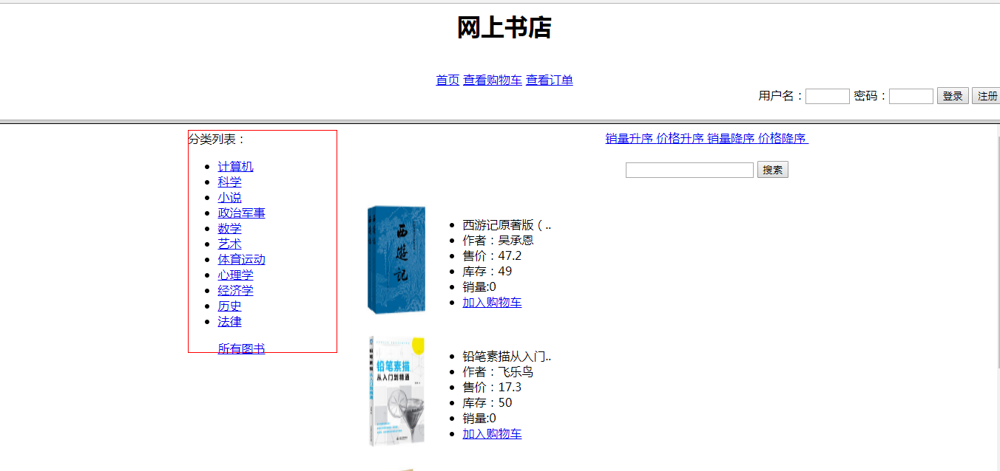

# bookstore 

## 破产版UI [网上书店](http://bs.woyumen4597.me)

## 预览

 

## 食用方法:

 1. 将bs2.8.sql导入mysql数据库
 
 2. 修改c3p0-config修改数据库信息
 
 3. 配置信息 在bookstore/bs/src/resource.properties
    - 主要是配置图片服务器的信息 和搜索服务solr的地址
 4. 前台 inde.jsp和 后台 manager.jsp可以管理
